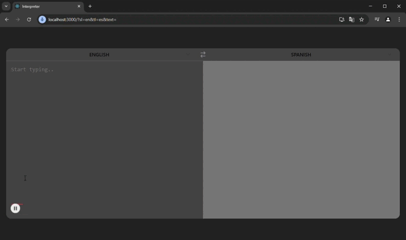

# Google Translate API

## 🛠️ Technology Stack


# Setup env node

Windows
```
$ set NODE_OPTIONS=--openssl-legacy-provider
```
Linux
```
$ export NODE_OPTIONS=--openssl-legacy-provider
```

# Start frontend
```
$ cd frontend  
$ npm install
```
# if error
```
$ npm install --force
```
```
$ npm start
```

# Demo Screenshot and Video

## Screenshots


## Video

